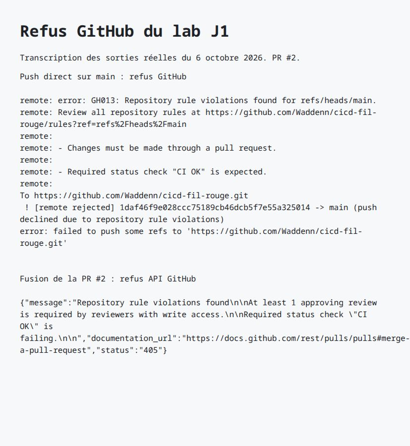
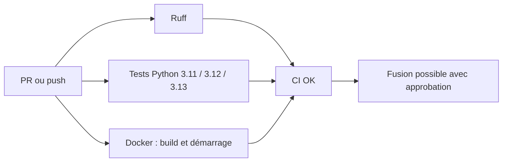
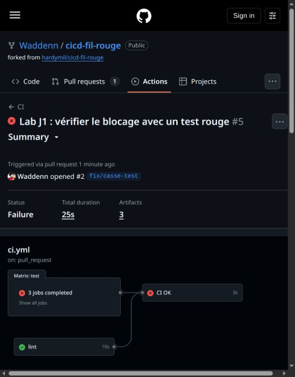

# TaskFlow — CI et protection du dépôt

[](https://github.com/Waddenn/cicd-fil-rouge/actions/workflows/ci.yml)

Lab J1 — cours CI/CD, Sup de Vinci. API de tâches en Python/FastAPI, issue du [dépôt de l’intervenant](https://github.com/hardymil/cicd-fil-rouge).

**Équipe :** [Tom PATELAS](https://github.com/Waddenn) et [Nicolas ROULOIS](https://github.com/Niccoco78).

**Objectif : empêcher qu’un changement non relu ou qui casse les tests arrive sur `main`.**

| Ce qui a été vérifié | Résultat et preuve |
| --- | --- |
| Protection de `main` | [Push direct refusé](reports/github/push-refuse.txt) |
| Test volontairement cassé | [PR #2](https://github.com/Waddenn/cicd-fil-rouge/pull/2) bloquée, puis fermée sans fusion |
| Relecture par le binôme | [PR #3](https://github.com/Waddenn/cicd-fil-rouge/pull/3) approuvée par Niccoco78, puis fusionnée |
| Tests et artefacts | **9 tests × 3 versions de Python** ; [rapport JUnit téléchargé](reports/github/artefact-python-3.11/junit.xml) |

## Gouvernance du dépôt

| Règle sur [main](https://github.com/Waddenn/cicd-fil-rouge/rules) | Pourquoi ? |
| --- | --- |
| PR et une approbation obligatoires | Faire relire le changement avant fusion |
| Nouvelle approbation après un commit ; discussions résolues | Valider la dernière version du code |
| Branche à jour et `CI OK` vert | Tester le changement avec la version actuelle de `main` |
| [Code Owners](.github/CODEOWNERS) sur les workflows | Faire relire les changements de la CI |
| Push direct, force push et suppression interdits, admins compris | Protéger l’historique et imposer ces contrôles |



*Transcription des sorties réelles de Git et de l’API GitHub : le push direct est refusé, puis la fusion est bloquée par les contrôles manquants.*

## Pipeline CI

Le [workflow](.github/workflows/ci.yml) tourne sur chaque PR vers `main` et chaque push sur `main`.



| Job | Contrôle |
| --- | --- |
| `lint` | Qualité du code et formatage avec Ruff |
| `test` | Dépendances compatibles (`pip check`), puis les 9 tests sur chaque version de Python |
| `docker` | Image construite, conteneur démarré et réponse de `/health` vérifiée |
| `CI OK` | Réussite de tous les jobs précédents |

**Pourquoi `CI OK` ?** Son nom reste fixe quand la matrice Python change : la règle de protection ne dépend pas des noms des jobs de test. Avec `always()` et une vérification explicite de chaque résultat, un échec ou un job ignoré empêche sa réussite.

Le cache pip réutilise les téléchargements ; les rapports JUnit restent disponibles **14 jours**, même si les tests échouent. Un nouveau push annule le run précédent de la même PR. Le contrôle Docker complète les exercices initiaux de J1.

### Prouver qu’une régression bloque la fusion

Dans la [PR #2](https://github.com/Waddenn/cicd-fil-rouge/pull/2), le test attend volontairement `ko` au lieu de `ok`. Les trois jobs Python et `CI OK` échouent ; GitHub refuse la fusion.



*Capture GitHub Actions : le lint passe, mais cela ne suffit pas pour fusionner.*

### Mesurer l’effet du cache

Durée de l’installation sur le même commit (`8cdac98`), avec des runners neufs :

| Python | Sans cache restauré | Avec cache restauré |
| --- | --- | --- |
| 3.11 | 6 s | 3 s |
| 3.12 | 6 s | 8 s |
| 3.13 | 6 s | 4 s |

[Run sans cache](https://github.com/Waddenn/cicd-fil-rouge/actions/runs/37442392450/attempts/2) · [Run avec cache](https://github.com/Waddenn/cicd-fil-rouge/actions/runs/37442392450/attempts/3).
Une seule comparaison, hors temps de restauration : le cache aide sur deux versions, sans garantir un gain à chaque run.

## Exercices — les idées à retenir

| Situation | Réponse et raison |
| --- | --- |
| Tests sur PR, copie FTP le vendredi | CI si intégrations fréquentes ; livraison encore manuelle |
| Image testée en staging, bouton du PO | **Continuous Delivery** : production déclenchée par une personne |
| Merge sur `main`, tests puis production automatique | **Continuous Deployment** |
| Jenkins mais branches de trois semaines | Pas de véritable CI : intégrations trop rares |
| Livraison automatisée, validation d’un comité | **Continuous Delivery** : décision humaine finale |
| Production automatique sans tests | Automatisation sans chaîne CI/CD fiable |

**Comment déployer le code relu ?** Associer le build au commit approuvé, construire une fois et promouvoir le même artefact immuable, identifié par son digest.

**Hash ou signature ?** Le hash permet de détecter une modification ; il ne protège pas l’historique et n’identifie pas l’auteur. La signature prouve la possession d’une clé, dont l’identité doit être vérifiée.

[Réponses détaillées](docs/exercices-j1.md) · [Déroulé et preuves des labs](docs/labs-github.md)

<details>
<summary><strong>Reproduire : installation, commandes et API</strong></summary>

## Lancer l'API en local

Prérequis : Python 3.10 ou plus récent.

```bash
git clone https://github.com/Waddenn/cicd-fil-rouge.git
cd cicd-fil-rouge
python3 -m venv .venv
source .venv/bin/activate          # Windows : .venv\Scripts\activate
pip install -r requirements-dev.txt
uvicorn app.main:app --reload
```

L'API répond sur http://localhost:8000 et sa documentation interactive est sur
http://localhost:8000/docs.

## Vérifier le code

```bash
pytest                 # tests automatiques
ruff check .           # lint
ruff format --check .  # vérification du formatage
```

## Lancer avec Docker

```bash
docker build -t taskflow .
docker run --rm -p 8000:8000 taskflow
```

## Endpoints

| Méthode | Chemin | Rôle |
| --- | --- | --- |
| GET | `/health` | État de l'API et version |
| GET | `/tasks` | Liste des tâches |
| GET | `/tasks/search?q=...` | Recherche dans les titres |
| POST | `/tasks` | Crée une tâche (`{"title": "..."}`) |
| GET | `/tasks/{id}` | Détail d'une tâche |
| PATCH | `/tasks/{id}/done` | Marque une tâche comme faite |
| DELETE | `/tasks/{id}` | Supprime une tâche (en-tête `X-API-Token` requis) |

## Configuration

| Variable | Rôle | Défaut |
| --- | --- | --- |
| `APP_VERSION` | Version affichée par `/health` | `0.1.0` |
| `DB_PATH` | Fichier SQLite | `taskflow.db` |
| `API_TOKEN` | Jeton exigé pour supprimer une tâche | vide (suppression désactivée) |
| `NOTIFY_WEBHOOK_URL` | Webhook appelé à chaque création de tâche | vide (désactivé) |


</details>
